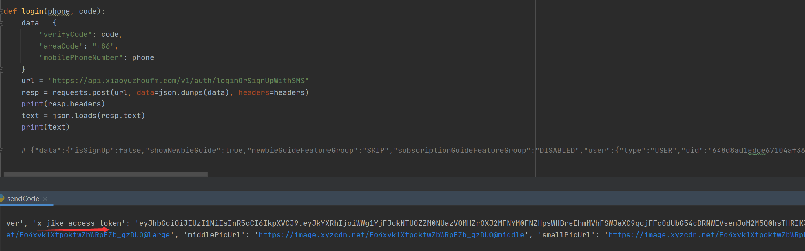
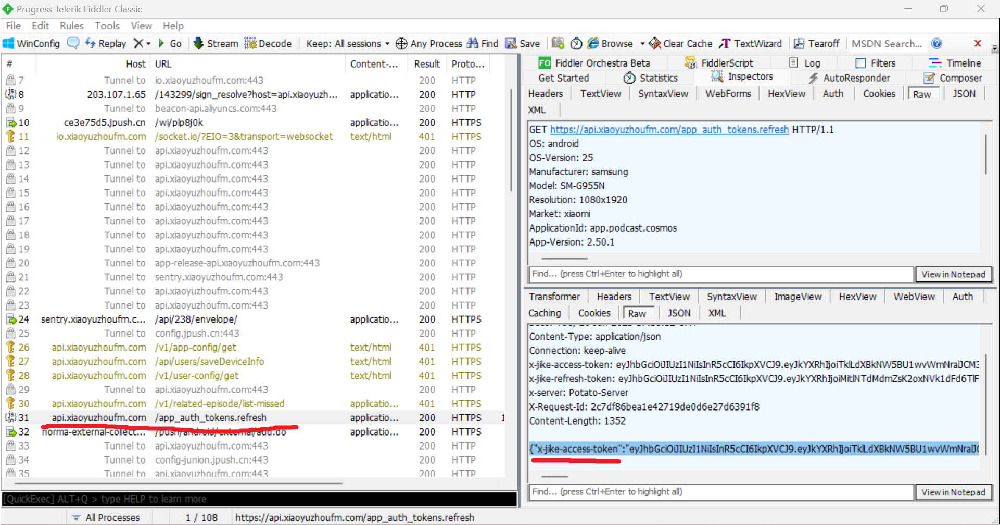

# 小宇宙APP爬虫分析

## fiddler+xposed进行分析

直接抓包,发现可以拿到明文数据,经过python测试可以直接拿到数据

到此只要token有效,，发送对应tab到该接口就可以爬取对应数据了.

## 进一步分析token

发现重启app后爬虫出现401认证失败

从登录开始分析`x-jike-access-token ` 怎么来的

抓包分析，发现在登陆时响应头携带access-token

用python模拟登录，成功拿到token

至此,就可以拿到token去爬虫了

加一点点细节,成功拿到数据

剩下的细节自己动手完成吧

## 总结

该app进行爬虫比较简单，没有对token加密，否则将进一步安卓逆向分析进行破解，或者使用appium进行爬虫

## 补充：token续签理论分析

试验得知，每次重启app或者经过一段时间后，token就会失效

重新打开app分析如何续签

我们发现token失效后,这个接口直接返回新的token

所以只要用这个接口我们token失效后就不用每次都重新登陆了

